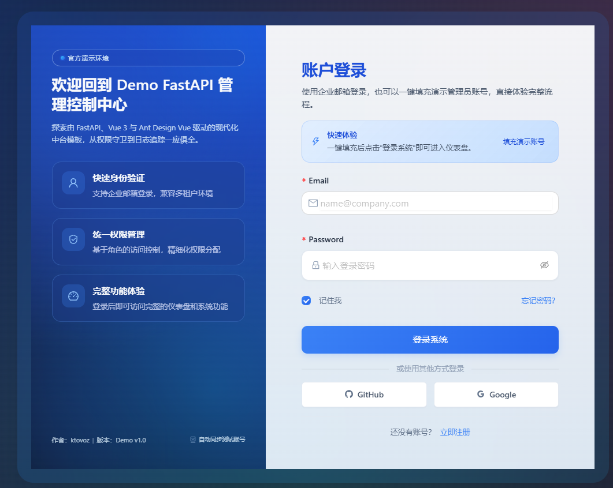
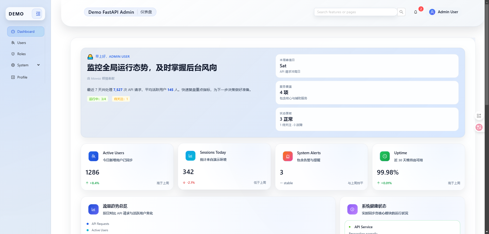
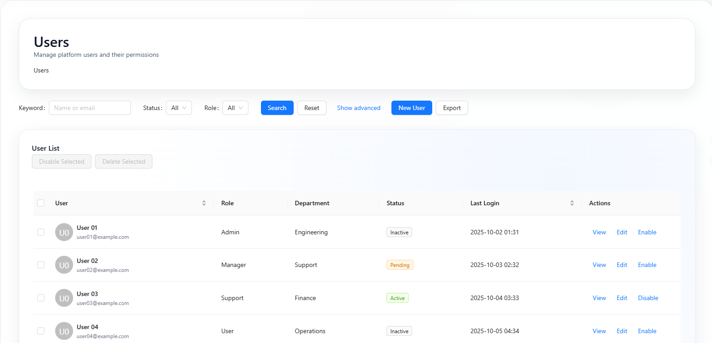
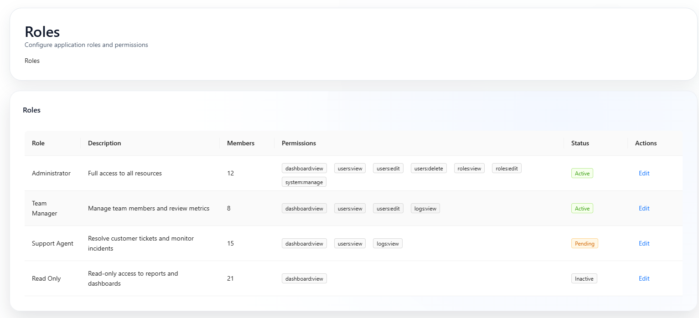
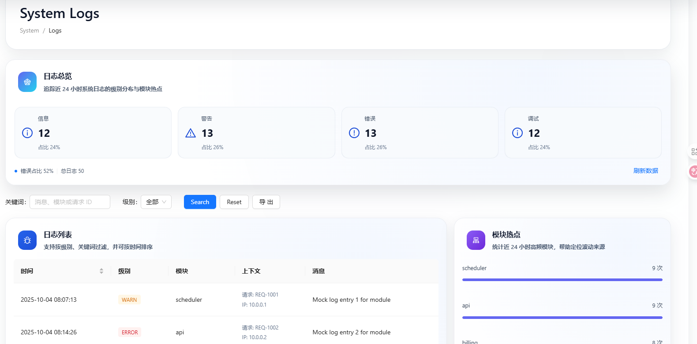
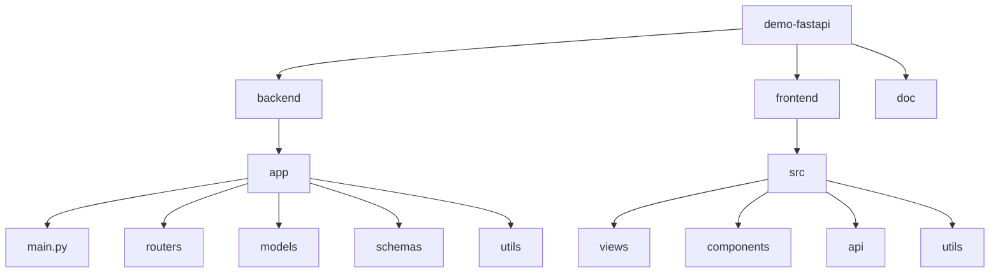

<div align="center">

# 🚀 Demo Admin System

<p>
  <a href="https://fastapi.tiangolo.com/">
    
  </a>
  <a href="https://vuejs.org/">
    
  </a>
  <a href="https://www.antdv.com/">
    
  </a>
  <a href="LICENSE">
    
  </a>
  <a href="https://ktovoz.com">
    
  </a>
  <a href="https://ktovoz.com">
    
  </a>
</p>

</div>

<div align="center">

> ✨ **现代化全栈后台管理系统解决方案**
> 🎯 基于 **FastAPI + Vue 3 + Ant Design Vue** 构建的企业级管理平台
> 🔐 完整的用户认证、权限控制、系统监控和日志管理
> 🚀 **在线演示**: [https://demo-fast.ktovoz.com](https://demo-fast.ktovoz.com) | 账号: `admin@example.com` / `admin123`

[📖 中文文档](#) | [🚀 快速开始](#-快速开始) | [📸 界面预览](#-界面预览) | [🛠️ 技术架构](#️-技术架构) | [📚 开发指南](#-开发指南)

</div>

---

## 🌟 项目亮点

<table align="center">
<tr>
<td width="50%">

### 🔥 **最新技术栈**
- **FastAPI** - 高性能异步Web框架
- **Vue 3** - 渐进式JavaScript框架
- **TypeScript** - 类型安全的JavaScript
- **Ant Design Vue** - 企业级UI组件库

</td>
<td width="50%">

### 🎨 **现代化设计**
- 响应式布局设计
- 深色/浅色主题切换
- 流畅的动画效果
- 企业级UI设计系统

</td>
</tr>
<tr>
<td width="50%">

### 🔐 **安全认证**
- JWT Token认证机制
- RBAC权限管理系统
- 密码加密存储
- 会话管理和安全控制

</td>
<td width="50%">

### 📊 **系统监控**
- 实时系统状态监控
- 用户行为统计分析
- 完整的操作日志记录
- 系统性能指标监控

</td>
</tr>
</table>

---

## 🌐 访问应用

### 🚀 在线演示

<div align="center">

| 链接 | 描述 |
|------|------|
| [🌐 演示地址](https://demo-fast.ktovoz.com) | 在线体验完整功能 |
| [📱 移动端](https://demo-fast.ktovoz.com) | 响应式移动端界面 |
| [🎯 管理后台](https://demo-fast.ktovoz.com) | 完整的管理功能 |

**演示账号**: `admin@example.com` / `admin123`

</div>

### 💻 本地开发

<div align="center">

| 服务 | 地址 | 描述 |
|------|------|------|
| 🎨 **前端应用** | http://localhost:3000 | Vue 3 开发服务器 |
| 📚 **API文档** | http://localhost:8000/docs | Swagger UI 文档 |
| 🔧 **备用API** | http://localhost:8000/redoc | ReDoc 文档 |

</div>

---

## 📸 界面预览

<div align="center">

### 🎨 **现代化登录界面**
<div align="center">
  
</div>

### 📊 **数据可视化仪表板**
<div align="center">
  
</div>

### 👥 **用户管理系统**
<div align="center">
  
</div>

### 🔑 **权限控制系统**
<div align="center">
  
</div>

### 📋 **系统日志监控**
<div align="center">
  
</div>

</div>

---

## 🎯 核心功能

<table align="center">
<tr>
<th>🔐 用户认证</th>
<th>👥 用户管理</th>
<th>🔑 权限管理</th>
<th>📊 系统监控</th>
</tr>
<tr>
<td>

✅ **功能特性**
- 邮箱/用户名注册登录
- JWT Token认证机制
- 密码加密存储 (bcrypt)
- Token自动刷新
- 完整的会话控制

</td>
<td>

✅ **功能特性**
- 用户列表分页查询
- 完整的CRUD操作
- 用户状态管理
- 批量操作支持
- 高级搜索过滤

</td>
<td>

✅ **功能特性**
- 基于角色的访问控制
- 角色创建和管理
- 权限分配和回收
- 用户角色关联
- 动态权限验证

</td>
<td>

✅ **功能特性**
- 实时系统状态监控
- 用户行为统计
- 完整的审计追踪
- 系统性能监控
- 异常日志追踪

</td>
</tr>
</table>

---

## 🚀 快速开始

### 📋 环境要求

<div align="center">

```bash
# 检查环境版本
node --version    # >= 16.0.0
python --version  # >= 3.8.0
git --version     # 最新版本
```

| 依赖 | 版本要求 | 用途 |
|------|---------|------|
| 🔵 **Node.js** | 16.0+ | 前端运行环境 |
| 🐍 **Python** | 3.8+ | 后端运行环境 |
| 📦 **Git** | Latest | 版本控制 |

</div>

### ⚡ 一键启动

<details>
<summary>📦 克隆项目</summary>

```bash
git clone https://github.com/your-username/demo-fastapi.git
cd demo-fastapi
```

</details>

<details>
<summary>🐍 启动后端 (FastAPI)</summary>

```bash
cd backend

# Windows 用户 🪟
python -m venv venv
venv\Scripts\activate
pip install -r requirements.txt
copy .env.example .env
python run.py

# Linux/Mac 用户 🐧
python -m venv venv
source venv/bin/activate
pip install -r requirements.txt
cp .env.example .env
python run.py
```

</details>

<details>
<summary>🎨 启动前端 (Vue 3)</summary>

```bash
cd frontend
npm install
npm run dev
```

</details>

### 🔑 默认账号

<div align="center">

| 角色 | 用户名 | 密码 | 权限范围 |
|------|--------|------|---------|
| 👑 **超级管理员** | `admin` | `admin123` | 全部权限 |
| 👤 **测试用户** | `test` | `test123` | 基础权限 |

</div>

---

## 🛠️ 技术架构

### 🐍 后端架构 (Python)

<div align="center">

| 技术 | 版本 | 用途 | 🌟 特性 |
|------|------|------|--------|
| **FastAPI** | 0.104.1 | 高性能异步Web框架 | 🚀 自动API文档 |
| **Uvicorn** | 0.24.0 | ASGI服务器 | ⚡ 高性能异步 |
| **SQLAlchemy** | Latest | ORM数据库工具 | 🗃️ 强大映射 |
| **Pydantic** | 2.5.0 | 数据验证和序列化 | ✅ 类型安全 |
| **JWT** | 3.3.0 | 身份认证 | 🔐 安全可靠 |
| **Passlib** | 1.7.4 | 密码加密 | 🔒 bcrypt加密 |
| **Loguru** | 0.7.2 | 日志系统 | 📝 简单易用 |
| **SQLite** | Built-in | 轻量级数据库 | 📦 开箱即用 |

</div>

### 🎨 前端架构 (JavaScript)

<div align="center">

| 技术 | 版本 | 用途 | 🌟 特性 |
|------|------|------|--------|
| **Vue 3** | 3.3.11 | 渐进式JavaScript框架 | ⚡ Composition API |
| **Ant Design Vue** | 4.0.8 | 企业级UI组件库 | 🎨 丰富组件 |
| **Vite** | 5.0.8 | 新一代构建工具 | ⚡ 极速热重载 |
| **Vue Router** | 4.2.5 | 路由管理 | 🧭 嵌套路由 |
| **Pinia** | 2.1.7 | 状态管理 | 📦 现代化Store |
| **Axios** | 1.6.2 | HTTP客户端 | 🌐 请求拦截 |
| **Loglevel** | 1.8.1 | 前端日志系统 | 📊 轻量级 |

</div>

---

## 🏗️ 项目结构

<div align="center">



```
📦 demo-fastapi/
├── 🚀 backend/               # FastAPI 后端服务
│   ├── 📁 app/              # 应用核心模块
│   │   ├── 🎯 main.py       # 应用入口文件
│   │   ├── 🛣️ routers/      # API路由模块
│   │   ├── 🗃️ models/       # 数据模型
│   │   ├── ✅ schemas/      # 数据验证模式
│   │   └── 🔧 utils/        # 工具函数库
│   │       └── 📝 logger.py # 日志系统配置
│   ├── 📋 requirements.txt  # Python依赖包
│   └── ▶️ run.py           # 启动脚本
├── 🎨 frontend/              # Vue 3 前端应用
│   ├── 📁 src/              # 源代码目录
│   │   ├── 📱 views/        # 页面视图组件
│   │   ├── 🧩 components/   # 公共组件库
│   │   ├── 🌐 api/          # API接口封装
│   │   └── 🔧 utils/        # 前端工具函数
│   │       └── 📝 logger.js # 前端日志系统
│   ├── 📦 package.json      # 依赖配置
│   └── ⚡ vite.config.js    # 构建工具配置
└── 📚 doc/                  # 项目文档说明
```

</div>

---

## 💻 开发指南

### 🔧 环境配置

<div align="center">

#### 🌱 开发环境
```bash
# 后端 - 自动热重载 🔄
python run.py

# 前端 - 热更新开发服务器 ⚡
npm run dev
```

#### 🚀 生产环境
```bash
# 构建前端 📦
npm run build

# 生产环境启动后端 🏭
uvicorn app.main:app --host 0.0.0.0 --port 8000
```

</div>

### 📚 API文档

<div align="center">

| 文档类型 | 地址 | 特性 |
|----------|------|------|
| **Swagger UI** | http://localhost:8000/docs | 🎨 交互式API文档 |
| **ReDoc** | http://localhost:8000/redoc | 📖 美观的API文档 |
| **OpenAPI Schema** | http://localhost:8000/openapi.json | 🔧 机器可读格式 |

</div>

### 🎯 核心API端点

<details>
<summary>🔐 认证模块</summary>

```http
POST /api/auth/login     # 用户登录
POST /api/auth/register  # 用户注册
POST /api/auth/refresh   # Token刷新
POST /api/auth/logout    # 用户登出
```

</details>

<details>
<summary>👥 用户管理</summary>

```http
GET    /api/users           # 获取用户列表
GET    /api/users/{id}      # 获取用户详情
PUT    /api/users/{id}      # 更新用户信息
DELETE /api/users/{id}      # 删除用户
```

</details>

<details>
<summary>🔑 权限管理</summary>

```http
GET    /api/roles           # 获取角色列表
POST   /api/roles           # 创建角色
PUT    /api/roles/{id}      # 更新角色
GET    /api/permissions     # 获取权限列表
```

</details>

<details>
<summary>📊 系统监控</summary>

```http
GET /api/dashboard/stats   # 系统统计
GET /api/logs              # 操作日志
GET /api/system/info       # 系统信息
```

</details>

### 📝 日志系统

<div align="center">

#### 🐍 后端日志 (Loguru)
```python
from app.utils.logger import get_logger

logger = get_logger(__name__)
logger.info("用户登录成功", user_id=user.id)
```

#### 🎨 前端日志 (Loglevel)
```javascript
import logger from '@/utils/logger'

logger.info('组件初始化完成')
const apiLogger = logger.createApiLogger()
apiLogger.request('GET', '/api/users')
```

</div>

---

## 👨‍💻 作者信息

<div align="center">

### 🌟 项目维护者

<div align="center">

| 📧 联系方式 | 链接 |
|-------------|------|
| 🌐 **个人网站** | [ktovoz.com](https://ktovoz.com) |
| 📚 **GitHub** | [@ktovoz](https://github.com/ktovoz) |
| 📧 **邮箱** | [hello@ktovoz.com](mailto:hello@ktovoz.com) |

</div>

**ktovoz** - 测试开发工程师

### 💼 专业服务

<div align="center">

| 服务 | 描述 |
|------|------|
| 🚀 **技术咨询** | 前后端架构设计与优化 |
| 🎨 **UI/UX设计** | 现代化界面设计 |
| 📱 **应用开发** | Web应用定制开发 |
| 🔧 **技术培训** | 团队技术能力提升 |

</div>

</div>

---

## 🤝 贡献指南

我们欢迎社区贡献！请查看 [CONTRIBUTING.md](CONTRIBUTING.md) 了解如何参与项目开发。

<div align="center">

### 🐛 报告问题
如果您发现了bug，请在 [Issues](https://github.com/ktovoz/demo-fastapi/issues) 页面提交问题报告。

### 💡 功能建议
有新功能想法？欢迎提交 [Feature Request](https://github.com/ktovoz/demo-fastapi/issues/new?template=feature_request.md)。

</div>

---

## 🙏 致谢

<div align="center">

感谢以下优秀的开源项目：

| 项目 | 描述 |
|------|------|
| **FastAPI** | 高性能Web框架 |
| **Vue.js** | 渐进式JavaScript框架 |
| **Ant Design Vue** | 企业级UI组件库 |
| **Vite** | 极速构建工具 |

</div>

---

## 📄 许可证

本项目基于 [MIT License](LICENSE) 开源协议发布。

<div align="center">

---

### 🌟 如果这个项目对您有帮助，请给我们一个 Star 支持！

<p>
  <a href="https://github.com/ktovoz/demo-fastapi">
    
  </a>
  <a href="https://github.com/ktovoz/demo-fastapi/fork">
    
  </a>
</p>

**🌟 想了解更多技术内容，欢迎访问 [ktovoz.com](https://ktovoz.com)**

---

<div align="center">

Made with ❤️ by [ktovoz](https://ktovoz.com)

</div>

</div>